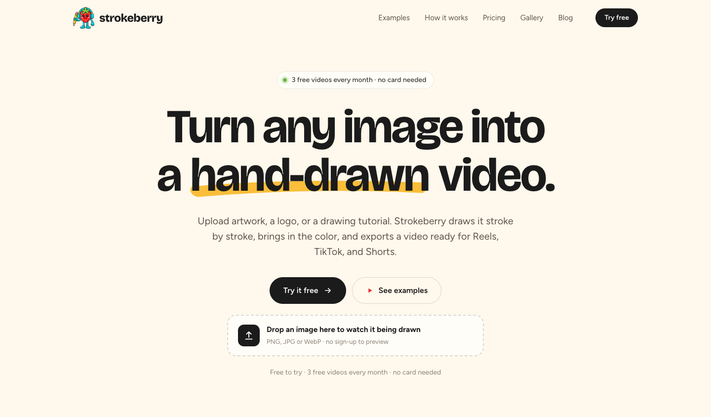
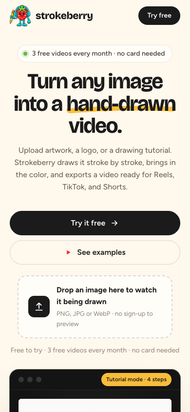
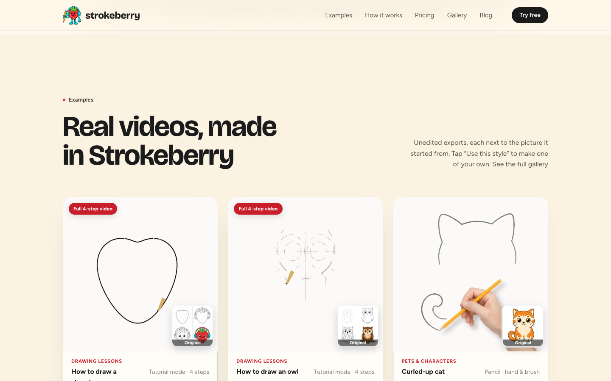
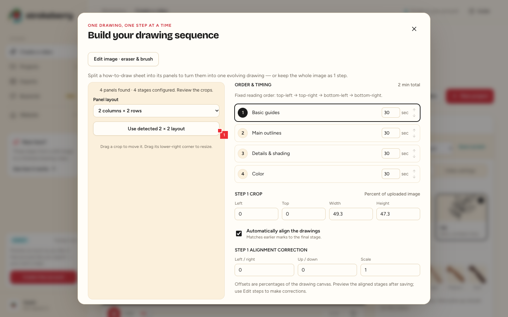
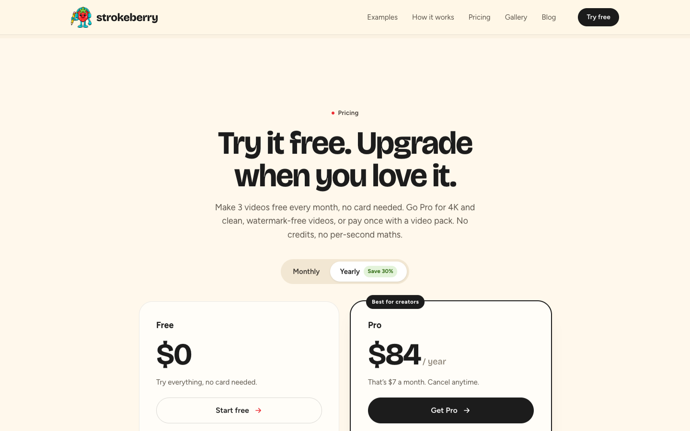
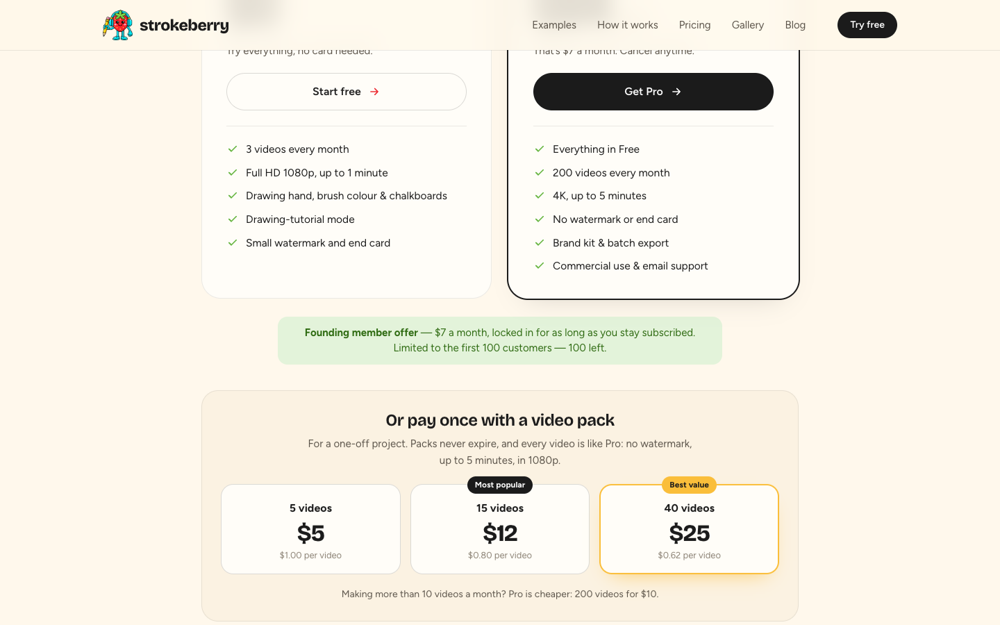
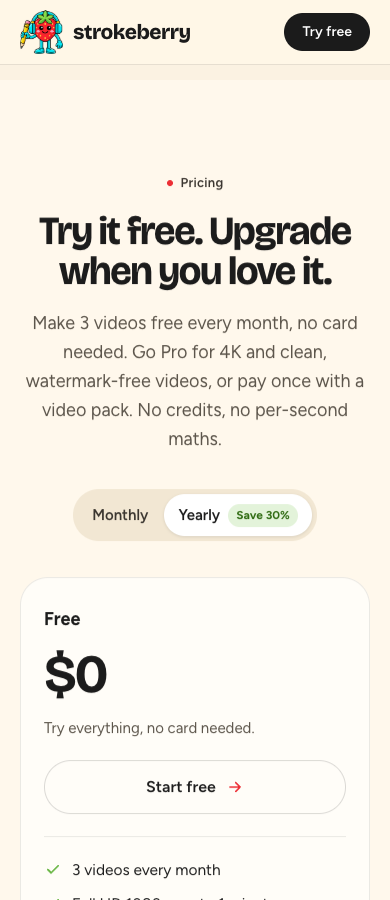
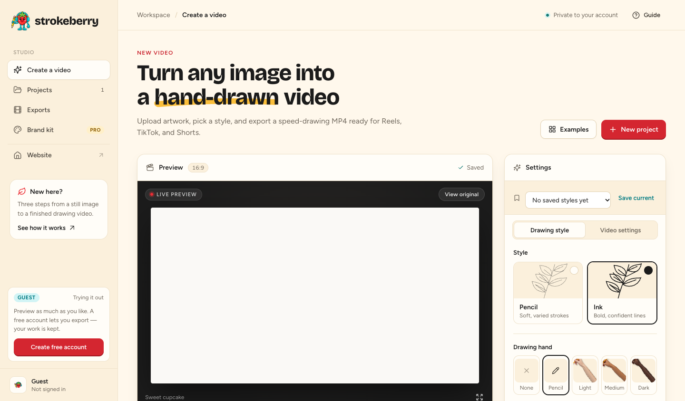
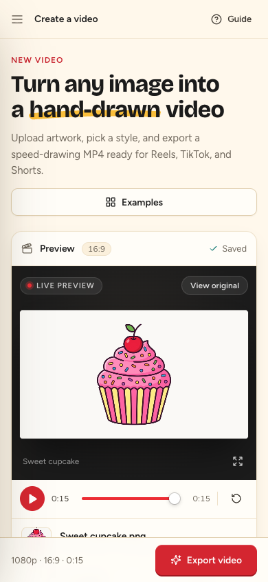
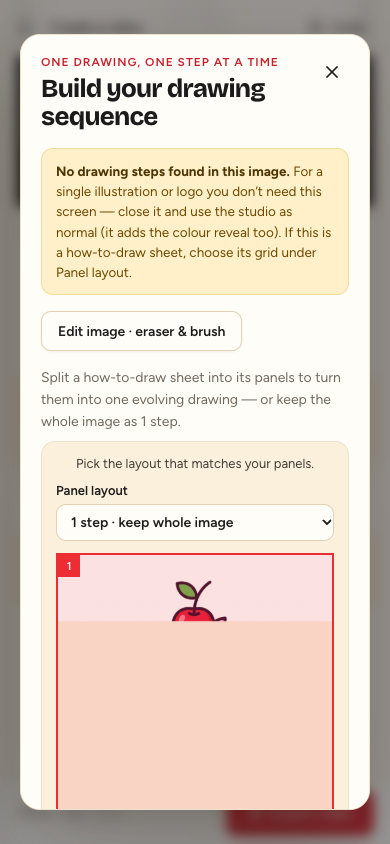

# Strokeberry production launch audit — 2 October 2026

**Scope:** the deployed https://strokeberry.com landing page, gallery, pricing, Studio, and public API on the Hostinger VPS behind Cloudflare. This supersedes the earlier local-only review. The screenshots below were captured from the live domain on 2 October 2026, at 1440px desktop and 390px phone widths.

**Launch judgment:** the live site is a credible public preview, with working guest sign-in, media, four-panel detection, and paid plans configured. Before promoting it as a paid service, fix the mobile upload path, test a real payment and export on the public domain, and prove the rendering service can tolerate launch load and a restart. No production purchase, paid export, or load test was performed during this audit.

## What visitors see

### Landing page

The brand is distinctive and the proposition is understandable quickly. The live hero strawberry video played in Chrome without a media error. At phone width there was no horizontal overflow or JavaScript console error. The image drop area is present, but the animated product proof starts at the bottom of the first phone screen. Repeated “3 free videos” copy and two CTAs occupy the space above it.

The page says “any image,” while the pipeline is most reliable with clean line art. A visitor with a photo, faint pencil drawing, or textured paper may not get the result shown in the gallery. Give such users an input-quality prompt before export and show a difficult-input example beside a successful one.

### Gallery and tutorials

The four-step examples are an effective selling point. The live gallery videos loaded and played when scrolled into view. The flagship strawberry card has a concrete link bug: its “Use this style” URL is /studio/?example=tutorial-00-owl, so it opens an owl rather than the strawberry shown. The owl example itself opened with **four detected crops** and displayed the top-left → top-right → bottom-left → bottom-right reading order.

### Pricing and founder offer

This is **different from the local configuration**: the live guest account reports Firebase authentication, Pro checkout enabled, yearly checkout enabled, and three video packs configured. The public /api/offer endpoint showed the $7 founding-member monthly price and 100 spots left. This confirms the offers are enabled in the application; it does **not** prove a completed charge, webhook delivery, entitlement, cancellation, or refund.

The pricing page defaults to Yearly at $84 ($7/month effective), while a founder banner below the cards offers $7/month locked in. The founder benefit is easy to miss and hard to distinguish from the yearly price without understanding that one is billed monthly and the other annually. Put a clear “Founding monthly: $7/month, billed monthly” choice beside the annual option. The Free card says “Try everything,” though Free has a one-minute cap, watermark/end card, and personal-use limitation; make that copy precise.

### Studio

The desktop Studio has an obvious New project button, sample preview, settings, and Guide. At 390px, CSS hides New project and the fixed bottom bar gives Export video the most prominent position. A first-time visitor must scroll below the sample preview to discover Replace before uploading their own image. This is the highest-impact product-flow issue observed on the live site. The phone step editor opened when its button was deliberately brought into view, but its first screen is long and requires substantial scrolling.

A fresh 390px guest visit took about **7.4 seconds** from navigation to the sample project becoming actionable in one headless Chrome run from this location. That is a single observation, not a global performance benchmark. The loading screen is mostly blank; show a progress message or skeleton, and measure first-action time in real-user monitoring.

## Findings ranked by launch impact

| Priority | Finding and evidence | Recommendation |
|---|---|---|
| **P0** | **Phone upload discovery.** The live Studio hides New project below 950px; the phone screenshot shows Examples and Export instead. | Put Upload image or New project above the preview and make the fixed bottom action match the user's current task. Test direct Studio entry and landing-page image handoff on iOS and Android. |
| **P0 release test** | **Payment-to-video path remains unverified.** Live billing flags and packs are enabled, but this audit did not complete checkout or a paid export. | Use a signed-in test account and a provider-approved transaction on strokeberry.com. Verify monthly founder discount, annual, each pack, webhook retries, entitlement, watermark removal, cancellation, refund, and download. |
| **P0 operational proof** | **One in-process render worker and queue.** Current server code uses one ThreadPoolExecutor worker and marks queued/rendering jobs failed after restart. Public VPS capacity and recovery were not measured. | Benchmark 60s 1080p and 5-minute 1080p/4K jobs on Hostinger while concurrent visitors upload. Establish queue limits and wait estimates from measurements, then add durable recovery, cancellation, disk limits, alerts, and a rehearsed backup restore. |
| **P1** | **Strawberry CTA opens the owl.** Confirmed in the live HTML. | Add the strawberry sheet to the example library and link to it, or change the CTA to a truthful generic tutorial example. |
| **P1** | **Guest comparison can end abruptly.** Code limits guests to three retained projects; the welcome sample takes one, and selecting an example creates another. | Keep examples ephemeral or reusable, and preserve work when prompting for a free account. Test a visitor comparing several examples before uploading. |
| **P1** | **Image-quality guidance is reactive.** Background cleanup is inside Edit image; no automatic preflight explains likely noise, low contrast, or uncertain tutorial alignment. | Suggest cleanup with before/after and a skip option before video creation. Warn when step alignment confidence is low, before an export is spent. |
| **P1** | **Discovery/SEO gaps on the live domain.** /sitemap.xml is 404; www and apex both return 200; pages lack canonical URLs; Cloudflare supplies only generic content-signal text at /robots.txt. | Choose one canonical host, redirect the other, add sitemap and canonical/absolute share metadata, and submit the site to search consoles. |
| **P1** | **Security/operations visibility.** The live landing response did not include HSTS, CSP, X-Content-Type-Options, Referrer-Policy, or frame controls; /docs and /openapi.json are public. App code does not implement rate limiting. Cloudflare rules and Hostinger monitoring were not accessible for verification. | Set suitable headers at the proxy, decide whether public API docs are intentional, verify WAF/rate rules, resource limits, backups, disk/queue/error alerts, and account isolation. Do not disable public docs solely for obscurity. |
| **P2** | **Social format default.** The homepage sells Reels/TikTok/Shorts, while Studio opens at 16:9. | Ask the destination at onboarding or make a prominent Vertical short 9:16 preset. |
| **P2** | **Support and legal operations.** Footer uses hi@strokeberry.com; refund and account deletion pages direct to support@strokeberry.com. A missing page returns JSON 404. | Test both inboxes, publish a consistent support route, rehearse refund/deletion requests, and add a branded 404 page. |

## Live checks and limits

- HTTPS answered 200 and HTTP redirected to HTTPS. The health endpoint reported FFmpeg available. The hero video had media readyState 4, played, and reported no error. Desktop and 390px Studio/landing pages had no horizontal overflow or page exceptions in the tested Chrome sessions.
- The public guest account reported auth=firebase, billing enabled, yearly enabled, and three packs. The four-step owl example detected four crops. A HEAD check found **0 broken targets among 104** page links and local assets from the landing, gallery, blog, legal, and Studio pages.
- The live Studio HTML and asset names matched the current local build. Cloudflare modified the landing HTML to protect its footer email address. The local-only billing conclusion in the previous report is therefore withdrawn.
- I did not create a real account, send an email, place an order, render a production MP4, inspect Hostinger configuration, or stress the VPS. Those items need a release-gate run, rather than inference from enabled flags or passing local unit tests.

## Recommended release gate

Record a fresh-visitor run on the public domain with timestamps and output files: phone and desktop upload → clean/quality suggestion → four-step crop review → account creation retaining the project → 60-second Free MP4 → Pro and pack purchases → 5-minute export in advertised quality → playback and download. Include duplicate and failed webhook delivery, cancelled payment, refund, server restart during a job, a near-full disk, passwordless email arrival, support email response, and backup restoration. Only mark each item passed when its actual production behavior has been observed.
